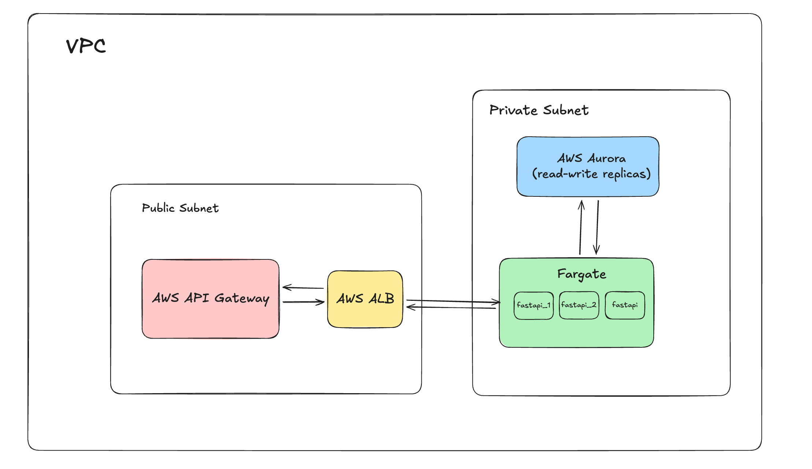

# Real-Time Bidding Service

A high-performance, production-ready real-time bidding (RTB) service built with FastAPI, designed for low-latency auction processing with enterprise-grade architecture.

## Table of Contents

- [Quick Start](#quick-start)
- [Performance Optimizations](#performance-optimizations)
- [Architecture](#architecture)
- [Scaling to Production](#scaling-to-production)
- [API Documentation](#api-documentation)

---

## Quick Start

### Prerequisites

- Docker & Docker Compose
- Git

### Setup & Run

1. **Clone the repository**

   ```bash
   git clone <repository-url>
   cd test-task
   ```

2. **Copy environment configuration files**

   ```bash
   cp env/.env.example .env
   cp env/.env.db.example .env.db
   ```

3. **Build and start the application**

   ```bash
   docker compose up --build
   ```

4. **Access the application**
   - API: http://localhost/api/v1
   - Health Check: http://localhost/health
   - Interactive API Docs: http://localhost/docs

The application will automatically:

- Initialize PostgreSQL primary database and read replica with streaming replication
- Run database migrations via Alembic
- Load test fixtures
- Start FastAPI with auto-calculated workers (2N+1 rule)
- Configure Redis for rate limiting
- Set up Nginx reverse proxy

---

## Performance Optimizations

This service is optimized for **high-throughput, low-latency real-time bidding** through several key techniques:

### 1. Fully Asynchronous Code (Non-Blocking Operations)

**Async/await throughout the entire stack** - FastAPI with async SQLAlchemy, async Redis client, and asyncpg driver for PostgreSQL. Handles thousands of concurrent requests with minimal resource usage, single worker processes multiple requests simultaneously without thread blocking.

### 2. Resolved N+1 Query Problem with Complex Queries

**Eager loading with `selectinload()` and `joinedload()`** - Reduces database round-trips from O(N) to O(1) by loading all relationships in a single optimized query. Instead of 1+N queries for auction with related data, executes just 1-2 queries total, significantly reducing database connections and latency.

### 3. Database Read-Write Replicas for Load Distribution

**PostgreSQL streaming replication** - Primary database handles all write operations (auctions, bids), read replica handles analytics and statistics queries. Zero competition between write and read operations, statistics don't impact auction processing performance. Primary at `db:5432` (read/write), Replica at `db_read_replica:5432` (read-only).

### 4. Auto-Scaling Worker Processes (2N+1 Rule)

**Dynamic worker calculation** - `WORKERS = 2 * CPU_CORES + 1` automatically adapts to host capabilities. Optimal for I/O-bound async operations, ensures maximum resource utilization without manual tuning. Examples: 4 cores → 9 workers | 8 cores → 17 workers | 16 cores → 33 workers.

---

## Architecture

This project implements **Domain-Driven Design (DDD)** with **Clean Architecture** principles, ensuring maintainability, testability, and flexibility.

### Architectural Layers

#### 1. Domain Layer (`src/domain/`)

**Pure business logic, framework-agnostic.** Contains core business entities (Auction, Bid, Bidder, Supply), business rules and domain logic (AuctionService), and abstract interfaces (IBiddingRepository, IRateLimiter). Has zero dependencies on other layers - completely independent.

#### 2. Application Layer (`src/application/`)

**Orchestrates use cases and coordinates domain services.** Contains application workflows (RunAuctionUseCase, GetStatsUseCase), coordinates multiple domain services, handles cross-cutting concerns (logging, error handling), and translates between API layer and domain layer. Depends only on Domain Layer.

#### 3. API/Infrastructure Layer (`src/api/` & `src/infrastructure/`)

**HTTP interface and technical implementations.** API layer contains FastAPI routers/endpoints, Pydantic request/response schemas, and dependency injection configuration. Infrastructure layer contains concrete implementations of domain interfaces (repositories), SQLAlchemy ORM models, database connection management, and external service integrations (Redis rate limiter, cache).

### Design Principles & Modularity

**Dependency Inversion (DIP):** High-level modules depend on abstractions, not concrete implementations. **Dependency Injection (DI):** FastAPI's built-in DI system with constructor injection. **Interface Segregation:** Each domain defines specific interfaces. **Single Responsibility:** Each layer has one reason to change.

**Modularity:** Infrastructure layer is completely swappable - switch databases (PostgreSQL→MongoDB), frameworks (FastAPI→Django), or cache (Redis→Memcached) by implementing interfaces without changing business logic.

---

## Scaling to Production

For production workloads requiring higher availability, performance, and scalability, deploy on **AWS with containerized infrastructure**.

### Production Architecture Diagram



### Recommended AWS Architecture

```
Internet
   ↓
AWS API Gateway (Regional)
   ↓
Application Load Balancer (ALB)
   ↓
AWS Fargate (ECS Tasks)
   ├── fastapi-1 (auto-scaled)
   ├── fastapi-2 (auto-scaled)
   └── fastapi-N (auto-scaled)
   ↓
Amazon Aurora PostgreSQL (Multi-AZ)
   ├── Primary Instance (Writer)
   └── Read Replicas (1-15 instances)
```

### Architecture Components

1. **AWS API Gateway** - API management, security, rate limiting, and edge caching
2. **Application Load Balancer (ALB)** - Layer 7 load balancing with health checks and SSL/TLS termination
3. **AWS Fargate (ECS)** - Serverless container orchestration with auto-scaling (2-20 tasks based on load)
4. **Amazon Aurora PostgreSQL** - Managed database with Multi-AZ deployment, up to 15 read replicas, auto-scaling storage

### Advantages of This Solution

#### High Availability

- **Multi-AZ Aurora:** 99.99% uptime SLA
- **Fargate tasks:** Distributed across availability zones
- **ALB:** Health checks with automatic traffic rerouting
- **Automatic failover:** Database and container failures handled automatically

#### Scalability

- **Horizontal scaling:** Add Fargate tasks automatically based on load
- **Read replica scaling:** Add up to 15 Aurora read replicas for read-heavy workloads
- **Global reach:** API Gateway with CloudFront for edge caching
- **Database sharding:** Aurora supports partitioning for extreme scale

#### Performance

- **Aurora performance:** 3x faster than standard PostgreSQL
- **Low latency:** Fargate tasks in same VPC as database
- **Connection pooling:** Maintained by application (SQLAlchemy)
- **Caching:** API Gateway + Redis (ElastiCache) for hot data

## API Documentation

### Endpoints

#### 1. Run Auction (POST /api/v1/bid)

**Request:**

```json
{
  "bidders": [
    {
      "id": 1,
      "bid_floor": 100
    }
  ],
  "supplies": [
    {
      "id": 1,
      "floor_price": 50
    }
  ]
}
```

**Response (200):**

```json
{
  "auction_id": 1,
  "winning_bids": [
    {
      "bidder_id": 1,
      "supply_id": 1,
      "amount": 150
    }
  ],
  "total_revenue": 150,
  "timestamp": "2025-12-04T10:30:00Z"
}
```

**Response (429 - Rate Limited):**

```json
{
  "error": "rate_limit_exceeded",
  "message": "Too many requests. Please try again later."
}
```

#### 2. Get Statistics (GET /api/v1/stat)

**Response (200):**

```json
{
  "total_auctions": 1000,
  "total_revenue": 150000,
  "top_bidders": [
    {
      "bidder_id": 1,
      "total_spent": 50000,
      "auction_count": 300
    }
  ],
  "top_supplies": [
    {
      "supply_id": 1,
      "total_revenue": 75000,
      "auction_count": 500
    }
  ]
}
```

#### 3. Health Check (GET /health)

**Response (200):**

```json
{
  "status": "healthy",
  "timestamp": "2025-12-04T10:30:00Z"
}
```

### Interactive Documentation

Once the application is running, visit:

- **Swagger UI:** http://localhost/docs
- **ReDoc:** http://localhost/redoc

---
